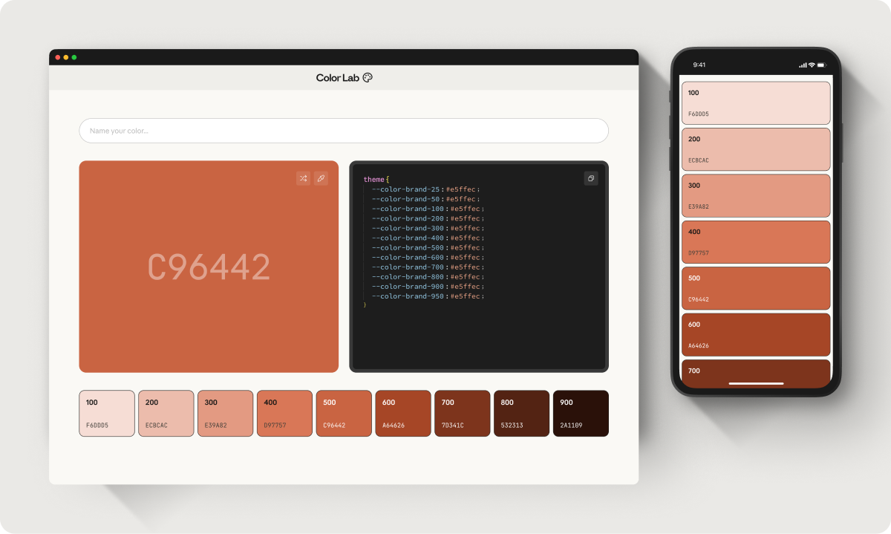

# Color Lab



Een interactieve kleurentool waarmee je vanuit één basiskleur automatisch een volledig, toegankelijk kleurenpalet genereert — inclusief kant-en-klare CSS-variabelen om direct in je project te plakken.

## Functionaliteit

- **Naam geven** — geef je kleur een naam (bijv. `brand`); deze naam wordt gebruikt in de gegenereerde CSS-variabelen
- **Kleur genereren** — shuffle naar een willekeurige hexkleur; een eyedropper-knop staat klaar voor het overnemen van een kleur van het scherm
- **Automatisch paletten** — op basis van de gekozen kleur wordt met [culori](https://culorijs.org) (in de OKLCH-kleurruimte) een schaal van 9 tinten gegenereerd (100 t/m 900), zodat lichtheid en verzadiging over de hele schaal consistent blijven
- **Code Output** — bekijk alle gegenereerde tinten direct als CSS-variabelen (`--color-<naam>-<stap>`) in een code-editor-achtige weergave, en kopieer de hele set met één klik
- **Color Output** — een paletrij met alle 9 tinten, met per tint de hexwaarde en automatisch de best leesbare tekstkleur (zwart/wit) op basis van WCAG-contrast; per tint ook los te kopiëren
- **Showcase** _(optioneel, uitgecommentarieerd in `app/page.tsx`)_ — voorbeeldkaarten die laten zien hoe het palet er in de praktijk uitziet (knoppen in default/hover/tertiary staat, licht en donker)
- Volledig responsive, van mobiel tot desktop
- Donkere modus via systeeminstellingen

## Tech stack

- [Next.js 16](https://nextjs.org) — App Router
- [React 19](https://react.dev)
- [TypeScript](https://www.typescriptlang.org)
- [Tailwind CSS v4](https://tailwindcss.com)
- [culori](https://culorijs.org) — kleurruimteberekeningen (OKLCH) en WCAG-contrastcontrole
- [Phosphor Icons](https://phosphoricons.com)

> **Let op:** dit project draait op een aangepaste versie van Next.js met afwijkingen t.o.v. de standaard documentatie. Zie `AGENTS.md` en `node_modules/next/dist/docs/` voordat je nieuwe App Router-functionaliteit toevoegt.

## Lokaal starten

```bash
npm install
npm run dev
```

Open [http://localhost:3000](http://localhost:3000) in je browser.

## Projectstructuur

```
app/
  layout.tsx          # Root layout met font en metadata
  page.tsx            # Hoofdpagina, houdt hex en naam state bij
  globals.css         # Globale stijlen en CSS-variabelen
sections/
  nav.tsx             # Navigatiebalk
  name.tsx            # Invoerveld om de kleur een naam te geven
  color_picker.tsx     # Kleurkiezer (shuffle + eyedropper)
  code_output.tsx      # CSS-variabelen als code, met kopieerknop
  color_output.tsx     # Paletrij met alle gegenereerde tinten
  footer.tsx            # Footer
components/
  color_variable.tsx   # Eén tint-kaart in de paletrij
  code_variable.tsx     # Eén regel CSS-variabele in de code-uitvoer
  showcase.tsx          # Voorbeeldkaarten die het palet in context tonen
data/
  generate_scale.tsx   # Genereert de 9-staps kleurschaal (OKLCH) uit een hexkleur
  random_hex.tsx        # Genereert een willekeurige hexkleur
  copy_clipboard.tsx    # Helper om tekst naar het klembord te kopiëren
```

## Scripts

| Commando        | Beschrijving              |
| --------------- | ------------------------- |
| `npm run dev`   | Start de dev-server       |
| `npm run build` | Bouw voor productie       |
| `npm run start` | Start de productie-server |
| `npm run lint`  | Voer ESLint uit           |
